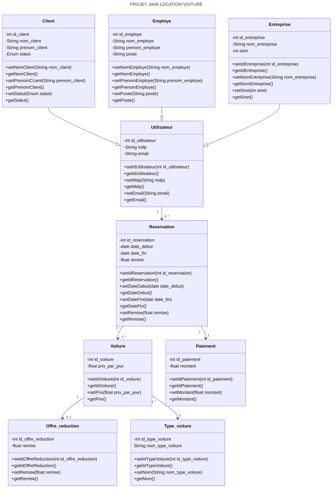

```mermaid
---
title: PROJET JAVA LOCATION VOITURE
---

classDiagram
    Client --|> Utilisateur
    Employe --|> Utilisateur
    Entreprise --|> Utilisateur
    Utilisateur "1" --> "0..*" Reservation
    Reservation "1" --> "1..*" Voiture
    Voiture "1" --> "0..1" Offre_reduction
    Reservation "1" --> "1" Paiement
    Voiture "1..*" --> "1" Type_voiture
    class Client{
        -int id_client
        -String nom_client
        -String prenom_client
        -Enum statut
        +setNomClient(String nom_client)
        +getNomClient()
        +setPrenomCLient(String prenom_client)
        +getPrenomClient()
        +setStatut(Enum statut)
        +getStatut()
    }
    class Entreprise{
        -int id_entreprise
        -String nom_entreprise
        -int siret
        +setIdEntreprise(int id_entreprise)
        +getIdEntreprise()
        +setNomEntreprise(String nom_entreprise)
        +getNomEntreprise()
        +setSiret(int siret)
        +getSiret()
    }
    class Employe{
        -int id_employe
        -String nom_employe
        -String prenom_employe
        -String poste
        +setNomEmploye(String nom_employe)
        +getNomEmploye()
        +setPrenomEmploye(String prenom_employe)
        +getPrenomEmploye()
        +setPoste(String poste)
        +getPoste()
    }
    class Utilisateur{
        -int id_utilisateur
        -String mdp
        -String email
        +setIdUtilisateur(int id_utilisateur)
        +getIdUtilisateur()
        +setMdp(String mdp)
        +getMdp()
        +setEmail(String email)
        +getEmail()
    }
    class Voiture{
        -int id_voiture
        -float prix_par_jour
        +setIdVoiture(int id_voiture)
        +getIdVoiture()
        +setPrix(float prix_par_jour)
        +getPrix()
    }
    class Type_voiture{
        -int id_type_voiture
        String nom_type_voiture
        +setIdTypeVoiture(int id_type_voiture)
        +getIdTypeVoiture()
        +setNom(String nom_type_voiture)
        +getNom()
    }
    class Reservation{
        -int id_reservation
        -date date_debut
        -date date_fin
        -float remise
        +setIdReservation(int id_reservation)
        +getIdReservation()
        +setDateDabut(date date_debut)
        +getDateDebut()
        +setDateFin(date date_fin)
        +getDateFin()
        +setRemise(float remise)
        +getRemise()
    }
    class Paiement{
        -int id_paiement
        -float montant
        +setIdPaiement(int id_paiement)
        +getIdPaiement()
        +setMontant(float montant)
        +getMontant()
    }
    class Offre_reduction{
        -int id_offre_reduction
        -float remise
        +setIdOffreReduction(int id_offre_reduction)
        +getIdOffreReduction()
        +setRemise(float remise)
        +getRemise()
    }

```